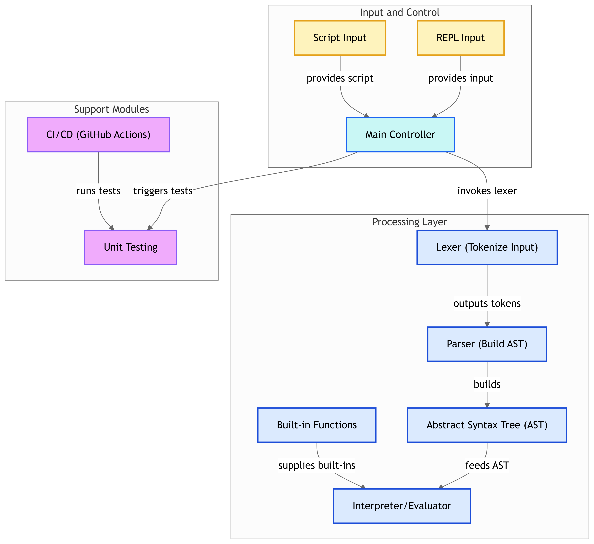

An implementation of lisp interpreter in Go



### Features

- Subset of Lisp: basic arithmetic operations, conditionals, and function definitions.
- Parse Input: A parser to read and tokenize Lisp expressions.
- Evaluate Expressions: An evaluator that recursively processes expressions, handling atoms, function calls, and special forms.
- Format function to handle the formatting of the string based on the provided arguments.
- Define Built-in Functions: Functions like addition, subtraction, multiplication, division and conditionals.
- Support User-Defined Functions: Allow users to define their own functions using defun.
- Support for lambda functions, local variables bindings(let) and logical operations(and, or and not)
- Support for basic list operations (car, cdr, cons, length, and append)
- Support for reading and execution of a Lisp script from lisp file
- A REPL: a Read-Eval-Print Loop (REPL) for interactive use.

### Structure

Separate of concerns into distinct components :
- Lexer: a set of constant tokens that the lexer will recognize, such as FORMAT, PLUS, MINUS,... in order to handle different types of tokens of the interpreter. The Tokenize is the lexer component. It takes an input string and splits it into a sequence of tokens.

- Parser: the Parse function is the parser component. It takes the sequence of tokens and constructs a Lisp expression tree (the AST).

- AST: the various Lisp value types (LispValue, LispAtom, LispNumber, LispString, LispList, LispFunction) are the AST components. These types represent the different node types in the Lisp expression tree.

- Main: the main function is responsible for the overall execution of the Lisp interpreter.
It handles the file execution mode and the REPL mode. It uses the Tokenize, Parse, and Eval functions to process the input and evaluate the expressions. It also includes the readMultilineInput and evalMultipleExpressions functions to handle multi-line input and evaluation of multiple expressions.

### Example Interaction
Arithmetic operations
````
> ( (+ 1 2) )
3
> ( (- 10 4) )
6
> ( (* 3 4) )
12
> ( (/ 8 2) )
4
````


Function definitions and conditionals
````
> ( (defun square (x) (* x x)) )
SQUARE

> ( (square 4) )
16

> ( (if (= 4 4) "equal" "not equal") )
equal

> ( (if (> 10 5) "greater" "less") )
greater

> ( (defun abs (x) (if (< x 0) (- 0 x) x)) )
ABS

> ( (abs -7) )
7

> ( (abs 7) )
7

````

Local variable bindings
````
> ( (let ((square (lambda (x) (* x x))))
    (square 5)) )
25

> ( (let ((a 10) (b 20))
    (+ a b)) )
30
> ( (let ((a 6))
    (if (and (< a 5) (> a 0)) "3 is comprised between 0 and 5" "3 is not comprised between 0 and 5")) )
    "3 is not comprised between 0 and 5"
````


Logical operations
````
> ( (and true true) )
true
> ( (and true false) )
false
> ( (or true false) )
true
> ( (or true true) )
true
> ( (not true) )
false
> ( (not false) )
true
````


List operations
````
> ( (car (list 1 2 3)) )
1
> ( (cdr (list 1 2 3)) )
(2 3)
> ( (cons 1 (list 2 3)) )
(1 2 3)
> ( (length (list 1 2 3 4)) )
4 
> ( (append (list 1 2) (list 3 4)) )
(1 2 3 4)
````

Formatting
````
> ( (format t "Hello World") )
> ( (let ((hello (lambda (nil)(nil) )))
    (format t "Hello Coding Challenge World")) )
"Hello Coding Challenge World"
> ( (let ((fact (lambda (n)
  (if (<= n 1)
    1
    (* n (fact (- n 1)))))))
    (format t "Factorial of 5 is %d" (fact 5))) )
"Factorial of 5 is 120"
````

### Run

- REPL mode
````
go run .
````

- File execution mode
````
go run . script.lisp
````

### Testing
````
go test -v
````

